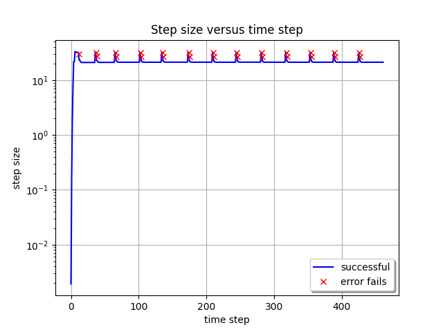
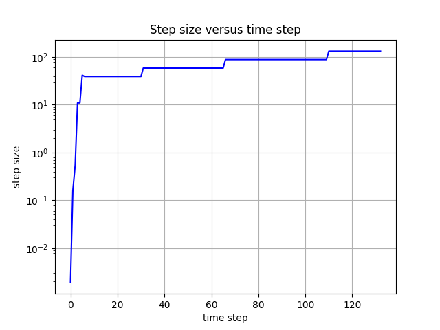
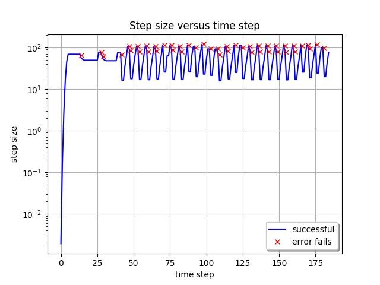

## At a Glance

|Questions|Objectives|Key Points|
|How do explicit, implicit or IMEX <br>methods impact step size?|Compare methods at step sizes <br>near the stability limit.|Choose time integration method <br>to match the problem.|
|What is the impact of an <br>*adaptive* technique?|Compare fixed and adaptive techniques.|Adaptive techniques can be robust <br>reliable and reduce computational cost.|
|How does integration *order* <br>impact cost?|Observe impact of order on time <br>to solution and number of steps.|Changing integration order is simple <br>allowing optimization for a given problem.|
|What is the role and benefit of <br>preconditioning?|Compare integration methods with <br>and without preconditioning.|Preconditioning is critical for scalability.|

## Setup Instructions

1. Connect to Theta:
   ```
   ssh [username]@theta.alcf.anl.gov
   ```

2. If you have not already done so, create a copy the hands-on lessons
   ```
    cd ~
    rsync -a /grand/ATPESC2022/EXAMPLES/track-5-numerical .
    ```

2. Request an interactive session on Theta GPU:
   ```
   qsub-gpu -I -q single-gpu -t 60 -n 1 -A ATPESC2022
   ```

3. Load the OpenMPI, BLAS, LAPACK, CMake, and conda modules and activate conda:
   ```
   module load openmpi/openmpi-4.1.4_ucx-1.12.1_gcc-9.4.0
   module load aocl/blis/blis-3.2
   module load aocl/libflame/libflame-3.2
   module load cmake-3.20.3-gcc-9.3.0-57eqw4f
   module load conda/2022-07-01
   conda activate
   ```

4. Change to the directory for this session where the precompiled executables,
   input files, and post processing scripts are located:
   ```
   cd track-5-numerical/time_integration_sundials/thetaGPU
   ```

Alternately, the source files are located under `time_integration_sundials/SUNDIALS+AMReX`
and can be compiled using the provided configuration script:
```
./config_atpesc_thetagpu.sh
cd build
make -j
```

The entire set of hands-on lesson codes is also available on
[GitHub](https://github.com/AMReX-Codes/ATPESC-codes), under the
`SUNDIALS+AMReX` directory.

## The Problem Being Solved

In this problem, we model the transport of a pollutant that has been released
into a flow in a two dimensional domain.  We want to determine both where the
pollutant goes, and when it has diffused sufficiently to be of no further harm.

[](sundials/sundials_amrex_setup.png)

This is an example of a scalar-valued advection-diffusion problem for chemical
transport. The governing equation is:

$$\frac{\partial u}{\partial t} + \vec{a} \cdot \nabla u -  \nabla \cdot ( D \nabla u ) = 0$$

where $$u = u(t,x,y)$$ is the chemical concentration, $$\vec{a}$$ is the
advection vector, $$D$$ is a diagonal matrix containing anisotropic diffusion
coefficients, and $$u(0,x,y)=u_0(x,y)$$ is a given initial condition. The
spatial domain is $$(x,y) \in [-1,1]^2,$$ and the time domain is $$t \in (0,10^4].$$

## The Application Models

The example application uses a finite volume spatial discretization with
[AMReX][2]. For the _time integration_ (i.e., semi-discretization in time) of
this PDE, we use the [ARKODE][0] ODE integrator from [SUNDIALS][1], to
demonstrate the use of [SUNDIALS][1] with CUDA parallelism for more robust
and flexible control over temporal integration.

Each application solves the problem on a periodic, cell-centered, uniform mesh
with an initial Gaussian bump:

$$u_0(x,y) = \frac{10}{\sqrt{2\pi}} e^{-50(x^2+y^2)}.$$

Snapshots of the solution for the advection [flow] vector
$$\vec{a}=\left[ 0.0005,\, 0.00025\right],$$ and diffusion coefficient matrix
$$D = \operatorname{diag}\left(\, \left[10^{-6},\, 10^{-6}\right]\,\right)$$ at
the times $$t = \left\{0, 1000, 2000, 3000\right\}$$ are shown in Figures 1-4
below:

|Figure 1|Figure 2|Figure 3|Figure 4|
|:---:|:---:|:---:|:---:|
|[](sundials/advection-diffusion-u0.png)|[](sundials/advection-diffusion-u1000.png)|[](sundials/advection-diffusion-u2000.png)|[](sundials/advection-diffusion-u3000.png)|

We will investigate this problem in three phases:

1. Explicit time integration ([HandsOn1.cpp][3], `HandsOn1.CUDA.exe`)

2. Implicit / implicit-explicit (IMEX) time integration ([HandsOn2.cpp][4], `HandsOn2.CUDA.exe`)

3. Preconditioning ([HandsOn3.cpp][5], `HandsOn3.exe` -- optional)

### Getting Help

You can discover the full set of command-line options for each setup with
the `help=1` argument, e.g.,

```text
$ mpirun -n 1 HandsOn1.CUDA.exe help=1
Initializing CUDA...
CUDA initialized with 1 GPU per MPI rank; 1 GPU(s) used in total
Initializing SUNDIALS with 1 threads...
SUNDIALS initialized.
MPI initialized with 1 MPI processes
MPI initialized with thread support level 0
AMReX (22.08-dirty) initialized

Usage: HandsOn1.exe [fname] [options]
Options:
  help=1
    Print this help message and exit.
  plot_int=<int>
    enable (1) or disable (0) plots [default=0].
  arkode_order=<int>
    ARKStep method order [default=4].
  fixed_dt=<float>
    use a fixed time step size (if value > 0.0) [default=-1.0].
  rtol=<float>
    relative tolerance for time step adaptivity [default=1e-4].
  atol=<float>
    absolute tolerance for time step adaptivity [default=1e-9].
  tfinal=<float>
    final integration time [default=1e4].
  dtout=<float>
    time between outputs [default=tfinal].
  max_steps=<int>
    maximum number of internal steps between outputs [default=10000].
  write_diag=<int>
    output ARKStep time step adaptivity diagnostics to a file [default=1].
  n_cell=<int>
    number of cells on each side of the square domain [default=128].
  max_grid_size=<int>
    max size of boxes in box array [default=64].
  advCoeffx=<float>
    advection speed in the x-direction [default=5e-4].
  advCoeffy=<float>
    advection speed in the y-direction [default=2.5e-4].
  diffCoeffx=<float>
    diffusion coefficient in the x-direction [default=1e-6].
  diffCoeffy=<float>
    diffusion coefficient in the y-direction [default=1e-6].

If a file name 'fname' is provided, it will be parsed for each of the above
options.  If an option is specified in both the input file and on the
command line, then the command line option takes precedence.
```

----

## Hands-on Lesson 1 -- Explicit Time Integration

This lesson uses `HandsOn1.CUDA.exe` and explores the following topics:

a. Problem specification -- vector wrapper and right-hand side functions

b. Fixed time-stepping (exploration of linear stability)

c. Adaptive time-stepping

d. Time integrator order of accuracy

### Problem Specification

There are essentially only three steps required to use SUNDIALS with an existing
simulation code:

1. Create an `N_Vector` wrapper for your application data structures, so that
   SUNDIALS can perform standard vector operations directly on your data.

   AMReX provides an `N_Vector` implementation wrapping its native `MultiFab`
   data structure (see the files [AMReX_NVector_MultiFab.H][6] and
   [AMReX_NVector_MultiFab.cpp][7] in the AMReX repository).

   This vector implements the vector operations need by SUNDIALS (linear
   combination $$\vec{z} \gets a\vec{x} + b\vec{y}$$, inner-product
   $$\left<\vec{x},\vec{y}\right>$$, etc.) and leverages the native `MultiFab`
   operations and `amrex::ParallelFor` to perform the computations on the CPU or
   GPU.

2. Create a function that computes the problem-defining ODE right-hand side
   function. In this example, we implement the advection-diffusion right-hand
   side function,

   $$f(t,u) = -\vec{a} \cdot \nabla u + \nabla \cdot ( D \nabla u )$$

   in the file [HandsOn_main.cpp][8] as

   ```C
   int ComputeRhsAdvDiff(Real t, N_Vector nv_sol, N_Vector nv_rhs, void* data)
   ```

   This function utilizes the AMReX `amrex::ParallelFor` to execute the
   computations the CPU or offload the work to the GPU.

3. Use SUNDIALS to integrate your ODE/DAE:

   1. Instantiate and fill an `N_Vector` for the initial condition,
      $$u_0(x,y)$$. In our example this is done [here][9] in `HandsOn_main.cpp`.

   2. Create the time integrator, providing both the initial condition vector
      $$u_0(x,y)$$ and the problem-defining function $$f(t,u)$$. In our example,
      this is done [here][10] in `HandsOn1.cpp`.

   3. Call the SUNDIALS integrator to evolve the problem over a series of out
      time intervals. Our example does this in a loop [here][11] in
      `HandsOn1.cpp`.

### Linear Stability

Run the first hands-on code using its default parameters (note that this uses a
mesh size of $$128^2$$ and fixed time step size of 5.0),

```bash
mpirun -n 1 ./HandsOn1.CUDA.exe inputs-1
```

and compare the final result against a stored reference solution (again on a
$$128^2$$ grid),

```bash
mpirun -n 1 ./fcompare plt00001/ reference_solution/
```

Notice that the computed solution error is rather small (the solution has
magnitude $$\mathcal{O}(1)$$, so we hope for errors well below 0.1).

Now re-run this hands-on code using a larger time step size of 100.0,

```bash
mpirun -n 1 ./HandsOn1.CUDA.exe inputs-1 fixed_dt=100.0
```

_see how much faster the code ran!_  However, if we check the accuracy of the
computed solution,

```bash
mpirun -n 1 ./fcompare plt00001/ reference_solution/
```

we see it has an incredibly large error (mine was $$\mathcal{O}(10^{284})$$).



Run the code a few more times, trying to identify the largest stable time step
size.

### Temporal Adaptivity

With this executable, we may switch to adaptive time-stepping (with the default
tolerances, $$rtol=10^{-4}$$ and $$atol=10^{-9}$$) by specifying `fixed_dt=0`,

```bash
mpirun -n 1 ./HandsOn1.CUDA.exe inputs-1 fixed_dt=0
mpirun -n 1 ./fcompare plt00001/ reference_solution/
```

_note how rapidly the executable finishes, providing a solution that is both
stable and accurate to within the specified tolerances!_

The time step sizes taken by the integrator in this run are seen below:

[](sundials/h_vs_iter-explicit.png)

_notice how rapidly the adaptive time-stepper finds the CFL stability limit_.
Also notice that the adaptivity algorithm periodically attempts to increase the
time step size to investigate whether this stability limit has changed; however,
the raw percentage of these failed steps remains rather small.


**Note**: *You can generate the above plot by runing the provided Python script `process_ARKStep_diags.py`:*

```bash
./process_ARKStep_diags.py HandsOn1_diagnostics.txt
```

*We included it here because it can be difficult to display graphics from the GPU compute nodes on Theta.*


Run the code a few more times with various values of `rtol` (e.g.,
`mpirun -n 1 ./HandsOn1.CUDA.exe inputs-1 fixed_dt=0 rtol=1e-6`) -- how well does the adaptivity
algorithm produce solutions within the desired tolerances?  How do the number of
time steps change as different tolerances are requested?

### Integrator Order and Efficiency

ARKODE defaults to a fourth-order accurate Runge--Kutta method, but many others
are included (explicit methods have available orders 2 through 8). Alternate
orders of accuracy may be run with the `arkode_order` option, e.g.,

```bash
mpirun -n 1 ./HandsOn1.CUDA.exe inputs-1 fixed_dt=0 arkode_order=8
mpirun -n 1 ./fcompare plt00001/ reference_solution/
```

_note the dramatic decrease in overall time steps (462 vs 260), but the
accompanying increase in total RHS evaluations (2900 vs 3790)._ Although
higher-order methods may indeed utilize larger step sizes (both for accuracy and
frequently stability), those come at the cost of increased work per step.

Run the code a few more times with various values of `arkode_order` for a fixed
value of `rtol` -- what is the most "efficient" overall method for this problem
at this tolerance?

----

## Hands-on lesson 2 -- Implicit / IMEX Time Integration

This lesson uses `HandsOn2.CUDA.exe` and explores the following topics:

1. Specification of algebraic solver algorithms (nonlinear and linear)

2. Fixed time-stepping (exploration of linear stability)

3. Adaptive time-stepping

4. Implicit-explicit partitioning

### Specification of Algebraic Solvers

Once your code is set up to run an explicit method, it is not difficult to
switch to an implicit or IMEX integrator.  All of the relevant changes for this
in are in the file [HandsOn2.cpp][4], and are indicated by the comment
`***** UPDATED FROM HandsOn1 *****`. The main steps are:

1. Move specification of the ODE right-hand side function to the *implicit*
   argument when creating the integrator, or supply separate routines that
   should be used for the IMEX splitting of the ODE right-hand side.

   This is done [here][12] in `HandsOn2.cpp`, where we either supply one function
   `ComputeRhsAdvDiff()` for *fully implicit* integration, or we supply two
   functions, `ComputeRhsAdv()` and `ComputeRhsDiff()`, for an IMEX splitting of
   the ODE right-hand side.

2. The default Newton nonlinear solver requires the user specify a linear solver
   for solving the inner linear system of equations for the Newton update.

   In this example, we create and attach an un-preconditioned GMRES iterative
   linear solver [here][13] in `HandsOn2.cpp`.

### Linear stability revisited

Run the second hands-on code using its default parameters (this also uses a mesh
size of $$128^2$$ and fixed time step size of 5.0),

```bash
mpirun -n 1 ./HandsOn2.CUDA.exe inputs-2
mpirun -n 1 ./fcompare plt00001/ reference_solution/
```

_note that this takes significantly longer than `HandsOn1.CUDA.exe` with the
same time step size._

Re-run this problem using the larger time step size of 100.0,

```bash
mpirun -n 1 ./HandsOn2.CUDA.exe inputs-2 fixed_dt=100.0
mpirun -n 1 ./fcompare plt00001/ reference_solution/
```

_again this version runs much more quickly, but now the results are usable!_



Run the code a few more times with larger time step sizes, checking the overall
solution error each time -- can you find an unstable step size?  Are there step
sizes where the code may be stable, but are so large that the nonlinear and/or
linear solver fails to converge?

### Temporal adaptivity revisited

As with the previous hands-on exercise, we can switch to adaptive time-stepping
(with tolerances $$rtol=10^{-4}$$ and $$atol=10^{-9}$$) by specifying
`fixed_dt=0`,

```bash
mpirun -n 1 ./HandsOn2.CUDA.exe inputs-2 fixed_dt=0
```

Compute the solution error as before,

```bash
./fcompare plt00001/ reference_solution/
```

The corresponding time adaptivity history plot is below:

[](sundials/h_vs_iter-implicit.png)

How does the average step size for this tolerance compare against the average
step size of `HandsOn1.CUDA.exe` for the same tolerances?



Run the code a few more times with various values of `rtol` -- how well does the
adaptivity algorithm produce solutions within the desired tolerances? How do the
number of time steps change as different tolerances are requested? Is this
algorithm more useful than the fully explicit approach when loose tolerances
(e.g., `rtol=1e-1`) are requested?

### IMEX partitioning

By default, `HandsOn2.CUDA.exe` uses a fully implicit formulation of the problem.
However, this can instead be run with the advection terms
$$\vec{a} \cdot \nabla u$$ treated explicitly by specifying `rhs_adv=1`, i.e.

```bash
mpirun -n 1 ./HandsOn2.CUDA.exe inputs-2 rhs_adv=1
mpirun -n 1 ./fcompare plt00001/ reference_solution/
```

For comparison, re-run an identical test but with fully-implicit treatment,

```bash
mpirun -n 1 ./HandsOn2.CUDA.exe inputs-2
mpirun -n 1 ./fcompare plt00001/ reference_solution/
```

Do you notice any efficiency or accuracy differences between fully implicit and
IMEX formulations with these fixed time-step tests?



Now that we again have an explicit portion of the problem, we should expect the
time step size to be CFL-limited. Run the IMEX version a few times with various
fixed time step sizes (the `fixed_dt` argument), checking the overall solution
error each time -- can you find a maximum stable step size?



We can again run the code using adaptive time stepping,

```bash
mpirun -n 1 ./HandsOn2.CUDA.exe inputs-2 rhs_adv=1 fixed_dt=0
mpirun -n 1 ./fcompare plt00001/ reference_solution/
```

The corresponding stepsize history plot with this configuration is below, and shows
similar behavior as we saw with the explicit method above.

[](sundials/h_vs_iter-imex.png)


----

## Out-brief

We have used AMReX and SUNDIALS as a demonstration vehicle for illustrating the
value of robust time integration methods in numerical algorithms. In particular,
we have used ARKODE's `ARKStep` time integration module from [SUNDIALS][1] to
explore a range of questions related to time integration and nonlinear solvers:

1. the benefits of _adaptive_ (vs _fixed_) time stepping for both performance
   and robustness of a simulation code,

2. the effects of the order of the time integration method on method efficiency,

3. the choice of IMEX partitioning in time discretization.

We note that our use of _adaptivity_ here was confined to the _time
discretization_ only. Other ATPESC lecturers demonstrate the advantages of
spatial adaptation as well (e.g., AMR).

We further note that we have barely scratched the surface of algebraic linear
solver algorithms; other of today's ATPESC lecturers focus specifically on
scalable and robust versions of these algorithms.

Finally, we note that the application demonstrated here can be run on much
larger spatial meshes and parallel architectures than we have used in this demo.

----

## Evening Hands-on Session -- Preconditioning

This lesson uses the Theta KNL nodes (rather than ThetaGPU) and `HandsOn3.exe`
to explore the following topics:

1. Preconditioner specification

2. Performance for IMEX time integrators

3. Performance for fully implicit time integrators

### Theta Setup Instructions

1. Connect to Theta:
   ```
   ssh [username]@theta.alcf.anl.gov
   ```

2. If you have not already done so, create a copy of the hands-on lessons
   ```
   cd ~
   rsync -a /grand/ATPESC2022/EXAMPLES/track-5-numerical .
   ```

3. Request an interactive session on Theta:
   ```
   qsub-knl -I -q ATPESC2022 -t 60 -n 1 -A ATPESC2022
   ```

4. Load the GNU programming environment, CMake, and conda modules:
   ```
   module swap PrgEnv-intel PrgEnv-gnu
   module load cmake/3.20.4
   module load conda/2021-09-22
   ```

5. Change to the directory for this session where the precompiled executables,
   input files, and post processing scripts are located:
   ```
   cd track-5-numerical/time_integration_sundials/thetaKNL
   ```

Alternately, the source files are located under `time_integration_sundials/SUNDIALS+AMReX`
and can be compiled using the provided configuration script:
```
./config_atpesc_theta.sh
cd build
make -j
```

The entire set of hands-on lesson codes is also available on
[GitHub](https://github.com/AMReX-Codes/ATPESC-codes), under the
`SUNDIALS+AMReX` directory.

### Preconditioner Specification

The file `HandsOn3.cpp` is nearly identical to the last example (with relevant
changes indicated by the comment `***** UPDATED FROM HandsOn2 *****`), however,
its default parameters differ slightly:

* it defaults to adaptive time-stepping (with the same default tolerances)

* it defaults to IMEX mode, with advection treated explicitly

* it defaults to using a preconditioner (discussed below).

Perhaps the most challenging (and most critical) component for a scalable
implicit or IMEX time integrator is the creation of an effective, efficient, and
scalable preconditioner to accelerate the iterative linear solvers (more on this
by other ATPESC speakers).  Use of a preconditioner with [SUNDIALS][1] requires
two steps:

1. Create preconditioner "setup" and "solve" routines that prepare any data
   structures necessary to perform preconditioning (called infrequently) and
   apply the preconditioner (called frequently), respectively.

   Here, we omit the setup function and provide a [preconditioner_solve][14]
   function, that employs a scalable geometric multigrid solver for only the
   diffusion portion of the problem, $$\nabla \cdot ( D \nabla u )$$.  This
   should be a perfect preconditioner when running in IMEX mode, but will only
   be approximate when running a fully implicit formulation of the problem.

2. Supply the preconditioning routines to the integrator.

   In our example, when creating the GMRES linear solver, we signal to use left
   preconditioning [here][15]. We then attach the `precondition_solve` routine
   to the integrator [here][16].

### Performance with IMEX integration

Run `HandsOn3.exe` using the default parameters,

```bash
aprun -n 1 -N 1 ./HandsOn3.exe inputs-3
```

and again with preconditioning disabled,

```bash
aprun -n 1 -N 1 ./HandsOn3.exe inputs-3 use_preconditioner=0
```

Note that the preconditioned version takes longer to run on this coarse problem,
but shows significant improvements in the overall number of linear solver
iterations. However, as the mesh is refined the preconditioned solver
performance will remain relatively "steady", while the un-preconditioned solver
will deteriorate rapidly.

### Performance with fully implicit integration

Re-run `HandsOn3.exe` using a fully-implicit problem formulation,

```bash
aprun -n 1 -N 1 ./HandsOn3.exe inputs-3 rhs_adv=1
```

Recall that this preconditioner only "preconditions" the diffusion portion of
the problem, so when run in a fully-implicit manner the implicit advection terms
are left un-preconditioned. Is this discrepancy noticeable when comparing the
integrator statistics (number of time steps, total linear iterations, etc.)?

### Scalability tests

Explore the weak scalability of `HandsOn3.exe` both with and without
preconditioning. Here, use from 1 to 256 MPI tasks, with a base grid of $$128^2$$
per MPI task, and retain the default temporal adaptivity. The choice of IMEX vs
fully implicit is yours. It is recommended that you submit a job script use the
batch queue instead of running interactively. Produce a weak scaling plot with
these results.

See the Theta job submission [documentation](https://www.alcf.anl.gov/support-center/theta/running-jobs-and-submission-scripts)
for more details on writing and running job scripts.

### Further reading

[SUNDIALS Documentation](https://sundials.readthedocs.io)

[0]: https://computing.llnl.gov/projects/sundials/arkode
[1]: https://computation.llnl.gov/projects/sundials
[2]: https://amrex-codes.github.io/amrex
[3]: https://github.com/AMReX-Codes/ATPESC-codes/blob/main/SUNDIALS%2BAMReX/HandsOn1.cpp
[4]: https://github.com/AMReX-Codes/ATPESC-codes/blob/main/SUNDIALS%2BAMReX/HandsOn2.cpp
[5]: https://github.com/AMReX-Codes/ATPESC-codes/blob/main/SUNDIALS%2BAMReX/HandsOn3.cpp
[6]: https://github.com/AMReX-Codes/amrex/blob/development/Src/Extern/SUNDIALS/AMReX_NVector_MultiFab.H
[7]: https://github.com/AMReX-Codes/amrex/blob/development/Src/Extern/SUNDIALS/AMReX_NVector_MultiFab.cpp
[8]: https://github.com/AMReX-Codes/ATPESC-codes/blob/main/SUNDIALS%2BAMReX/HandsOn_main.cpp#L285
[9]: https://github.com/AMReX-Codes/ATPESC-codes/blob/main/SUNDIALS%2BAMReX/HandsOn_main.cpp#L75-L78
[10]: https://github.com/AMReX-Codes/ATPESC-codes/blob/main/SUNDIALS%2BAMReX/HandsOn1.cpp#L57
[11]: https://github.com/AMReX-Codes/ATPESC-codes/blob/main/SUNDIALS%2BAMReX/HandsOn1.cpp#L88
[12]: https://github.com/AMReX-Codes/ATPESC-codes/blob/main/SUNDIALS%2BAMReX/HandsOn2.cpp#L60-L73
[13]: https://github.com/AMReX-Codes/ATPESC-codes/blob/main/SUNDIALS%2BAMReX/HandsOn2.cpp#L98-L101
[14]: https://github.com/AMReX-Codes/ATPESC-codes/blob/main/SUNDIALS%2BAMReX/HandsOn_main.cpp#L458
[15]: https://github.com/AMReX-Codes/ATPESC-codes/blob/main/SUNDIALS%2BAMReX/HandsOn3.cpp#L103-L110
[16]: https://github.com/AMReX-Codes/ATPESC-codes/blob/main/SUNDIALS%2BAMReX/HandsOn3.cpp#L122
